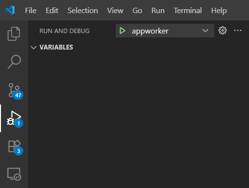
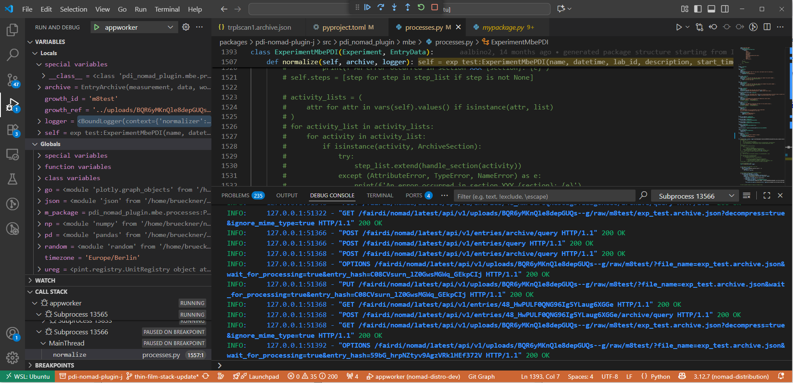

# **Workshop Structure: NOMAD Development & Plugins**

## **[Prerequisites](#prerequisites)**

* **Admin rights:** Users must have administrator rights on their computer to install software and change system settings.

* **Software to be installed:** Docker Desktop, WSL2, Python, Node.js, Yarn, VSCode

* **Accounts:** GitHub account, central NOMAD account (www.nomad-lab.eu)

* **Notes:** Check available disk space, memory, and internet connection

## **[Introduction](#introduction)**

* Welcome & goals of the workshop

* Quick participant check (who already uses NOMAD, Git, Docker?)

* Present prerequisites & confirm everyone is set up

## **[Part 1: Setup & Environment](#part-1-setup--environment)**

* **Topic:** Install NOMAD Distro Dev on Windows

* **Method:** Live demo \+ guided installation by participants

* **Output:** Everyone has a running local NOMAD instance

## **[Part 2: Developing NOMAD Plugins](#part-2-developing-nomad-plugins)**

* **Topic:** Install, activate, and modify NOMAD plugins.

* **Method:** Walk through the structure of a plugin, add one to the dev environment, then make and test a small code change using logs, CLI tests, and the GUI.

* **Output:** Participants understand plugin anatomy, can install and activate plugins, and are able to implement and validate code changes locally.

## **[Part 3: Collaborative Development with Git and GitHub](#part-3-collaborative-development-with-git-and-github)**

* **Topic:** Working with Git & GitHub

* **Method:** Branch → commit → push → pull request → merge

* **Output:** Participants contribute a change to a shared repo

## **[Part 4: Writing and Publishing a NOMAD Oasis Image (with Plugins)](#part-4-writing-and-publishing-a-nomad-oasis-image-with-plugins)**

* **Topic:** Write new NOMAD Oasis image

* **Method:** Build Docker image with plugin, run locally, optionally deploy on server

* **Output:** Working custom NOMAD Oasis instance with plugin

## **[Wrap-Up & Q\&A](#wrap-up--qa)**

* Recap main learning points

* Common pitfalls & troubleshooting tips

* Resources (docs, GitHub, community channels)

* Open floor for participant questions

---


# Introduction

Welcome to the **NOMAD Development & Plugins Workshop** 🎉

The goal of this workshop is to:

* Set up a complete **NOMAD development environment** on your Windows PC

* Learn how to **install, modify, and test plugins**

* Practice using **Git and GitHub** to manage changes collaboratively

* Build and deploy your own **NOMAD Oasis image**

By the end of the workshop, you will:

* Have a working local NOMAD development setup

* Understand the plugin structure and how to extend NOMAD

* Be able to contribute changes via GitHub

* Know how to package and run your own NOMAD Oasis with custom plugins

---

## What we will do and why

This workshop will guide you through the full development cycle:

1. **System preparation**

   * Set up WSL2 and Docker Desktop

   * Install additional software (Python, Node.js, Yarn, uv)

2. **NOMAD distro-dev**

   * Clone and run the NOMAD development distribution

3. **Plugin development**

   * Install and activate a plugin

   * Modify the plugin and test changes (via CLI and GUI)

4. **Collaboration with GitHub**

   * Push changes, open pull requests, merge into main

5. **Deployment**

   * Build and run a NOMAD Oasis image with your plugin

This end-to-end workflow mirrors how real NOMAD development is done in practice.

---

## Participant check

Before we dive in:

* Who already has experience with **NOMAD, Git, or Docker**?

* Who has used **WSL2 on Windows** before?

* Who has **installed VS Code** and feels comfortable with the terminal?

This helps us adapt the pace of the workshop.

---

## Prerequisites

Please make sure you have:

* A **NOMAD account** ([https://www.nomad-lab.eu](https://www.nomad-lab.eu))
* A **GitHub account** (with ability to fork and push to repositories)
* **Software prerequisites** (Docker Desktop, WSL2, Git, Python, Node.js, Yarn, uv, VS Code)

👉 We will check in the next section if these tools are installed and working correctly.
 If something is missing, we will fix it together.

# Part 1: Setup & Environment

## Installation Paths

There are two ways to set up NOMAD development on Windows:

- **Path A (recommended):** Use **WSL2 (Windows Subsystem for Linux)** with Ubuntu
  → Provides a Linux environment close to production, fewer path and dependency issues. Could be more stable since most NOMAD developer run and test their developments in Linux.
- **Path B (alternative):** Install and run everything **directly in Windows**
  → Simpler if IT restrictions make WSL/Docker integration difficult, but can run into Windows-specific issues.

---

## Checking Software Requirements

Before we start with NOMAD distro-dev, let’s verify that all required tools are installed and working.
 Run the following checks in **Windows Terminal** (use **PowerShell** and/or **Ubuntu (WSL)** tabs depending on your chosen path). Type `wsl` in PoweShell to start WSL2.

---

### 1\) Check WSL

**PowerShell:**

```
wsl --status
```

* ✅ Installed → shows version info (should include `WSL version: 2`)

* ❌ Not installed → IT must install WSL (admin rights)

**PowerShell (list distros):**

```console
wsl --list --verbose
```

* ✅ `Ubuntu` (or another distro) listed

* ❌ Missing → install with:

```console
wsl --install -d Ubuntu
```

---

### 2\) Check Docker Desktop

**PowerShell:**

```python
docker --version
docker run hello-world
```

* ✅ Prints Docker version and shows “Hello from Docker\!”

* ❌ Error → Docker Desktop not installed or not running

**If you use Path A (WSL), also check inside Ubuntu:**

```console
docker --version
docker run hello-world
```

* ❌ If daemon not reachable → enable **Ubuntu** under Docker Desktop → **Settings → Resources → WSL integration**, then retry

---

### 3\) Check Git

**Ubuntu (Path A):**

```console
git --version
```

**Windows (Path B):**

```console
git --version
```

* ✅ Returns a version (e.g., `git version 2.x`)

---

### 4\) Check Python

**Ubuntu (Path A):**

```console
python3 --version
```

**Windows (Path B):**

```console
python --version
```

* ✅ Returns `3.x.x`

* ⚠️ On Windows, ensure **Long Paths** are enabled if you’ll install lots of Python deps

---

### 5\) Check Node.js & npm

**Ubuntu or Windows (your path):**

```console
node -v
npm -v
```
* ✅ Both return versions (e.g., `v20.x`, `10.x`)

---

### 6\) Check Yarn

```console
yarn --version
```

* ✅ Returns a version (e.g., `1.22.x` or `4.x`)

---

### 7\) Check uv

```console
uv --version
```

* ✅ Returns a version

---

### 8\) Check VS Code Integration

**Ubuntu (Path A):**

```console
code .
```

* ✅ VS Code opens with green status bar: **WSL: Ubuntu**

* ❌ If `code` not found → in VS Code (Windows) run **Shell Command: Install 'code' command in PATH** from the Command Palette, then retry

**Windows (Path B):**

```console
code .
```

* ✅ VS Code opens in the current folder

---

If all checks pass, your system is ready for **NOMAD distro-dev**. If something fails, we’ll fix it before moving on.

---

### System Check: Quick Checklist

| Done | Tool | Command | Expected Output |
| ----- | ----- | ----- | ----- |
| - [ ] | **WSL** | `wsl --status` | Shows version info, includes `WSL version: 2` |
| - [ ] |  | `wsl --list --verbose` | `Ubuntu` (or another distro) listed |
| - [ ] | **Docker** | `docker --version` | Docker version (e.g., `Docker version 27…`) |
| - [ ] |  | `docker run hello-world` | Message “Hello from Docker\!” |
| - [ ] | **Git** | `git --version` | Version string (e.g., `git version 2.43.0`) |
| - [ ] | **Python** | `python3 --version` *(Ubuntu)* | `3.x.x` |
| - [ ] |  | `python --version` *(Windows)* | `3.x.x` (ensure Long Paths enabled in Windows) |
| - [ ] | **Node.js** | `node -v` | Node version (e.g., `v20.11.1`) |
| - [ ] | **npm** | `npm -v` | npm version (e.g., `10.5.2`) |
| - [ ] | **Yarn** | `yarn --version` | Yarn version (e.g., `1.22.19` or `4.x`) |
| - [ ] | **uv** | `uv --version` | uv version |
| - [ ] | **VS Code** | `code .` | VS Code opens (WSL mode shows **WSL: Ubuntu**) |

---

## Installation Guide

This guide lists the tools required for NOMAD development on Windows in the **recommended order of installation**:

1. **WSL2**
2. **Docker Desktop**
3. **Other developer tools** (Git, Python, uv, Node.js, Yarn, VS Code)

---

### 1) Install WSL2

WSL2 (Windows Subsystem for Linux) provides a Linux environment on Windows.

#### 1.1 Enable WSL (run as Administrator)
```powershell
wsl --install
```
- Installs WSL and the default Linux distribution (Ubuntu).
- To explicitly install Ubuntu:
```powershell
wsl --install -d Ubuntu
```

If WSL is already installed, ensure you’re on WSL 2:
```powershell
wsl --set-default-version 2
wsl --update
```

#### 1.2 Verify WSL installation
```powershell
wsl --status
wsl --list --verbose
```
- Expect `WSL version: 2`
- `Ubuntu` should be listed

#### 1.3 Launch Ubuntu
Open **Windows Terminal → Ubuntu** (first launch prompts you to create a Linux username/password).

---

### 2) Install Docker Desktop

Docker is required to run NOMAD and build images.

#### 2.1 Download & install (requires Administrator)
- Download: [Docker Desktop for Windows](https://docs.docker.com/desktop/setup/install/windows-install/)
- During setup, **enable “Use WSL 2 instead of Hyper-V”**
- Restart when prompted

#### 2.2 Verify Docker (Windows side)
```powershell
docker --version
docker run hello-world
```

#### 2.3 Verify Docker (Ubuntu/WSL side)
```bash
docker --version
docker run hello-world
```

#### 2.4 Ensure WSL integration is enabled
Open **Docker Desktop → Settings → Resources → WSL Integration** and enable **Ubuntu**.

> If `docker run hello-world` fails inside Ubuntu with a daemon error, enable WSL integration for Ubuntu, then retry.

---

### 3) Install Other Developer Tools

#### 3.1 Git

**Ubuntu (Path A – recommended):**
```bash
sudo apt update
sudo apt install -y git
git --version
```

**Windows (Path B – alternative):**
- Download: [Git for Windows](https://git-scm.com/download/win)
- Choose **“Install for me only”** if you want to avoid admin rights
- Verify:
```powershell
git --version
```

---

#### 3.2 Python

**Ubuntu (Path A):**
```bash
sudo apt install -y python3 python3-pip python3-venv
python3 --version
```

**Windows (Path B):**
- Download: [Python for Windows](https://www.python.org/downloads/windows/)
- Check **Add python.exe to PATH**
- Check **Enable long path support** (or enable later as below)
- Choose **“Install for me only”** to avoid admin rights
- Verify:
```powershell
python --version
```

**Windows long path fix (important for deep dependency trees):**
- Group Policy (admin):
  - `Computer Configuration → Administrative Templates → System → Filesystem → Enable Win32 long paths = Enabled`
- Registry (admin):
```powershell
reg add HKLM\SYSTEM\CurrentControlSet\Control\FileSystem `
  /v LongPathsEnabled /t REG_DWORD /d 1 /f
```

---

#### 3.3 uv (fast Python package manager)

**Ubuntu (Path A):**
```bash
curl -LsSf https://astral.sh/uv/install.sh | sh
source ~/.bashrc
uv --version
```

**Windows (Path B):**
```powershell
powershell -ExecutionPolicy ByPass -c "irm https://astral.sh/uv/install.ps1 | iex"
uv --version
```

---

#### 3.4 Node.js & npm

**Ubuntu (Path A) – via nvm (no root needed):**
```bash
curl -fsSL https://raw.githubusercontent.com/nvm-sh/nvm/v0.39.7/install.sh | bash
source ~/.bashrc
nvm install --lts
node -v
npm -v
```

**Windows (Path B) – ZIP (no admin):**
1. Download **Windows x64 ZIP** from [Node.js downloads](https://nodejs.org/en/download)
2. Extract to: `C:\Users\<YourUsername>\nodejs`
3. Add this folder to **User PATH** (Environment Variables → User → Path → Add)
4. Verify:
```powershell
node -v
npm -v
```

---

#### 3.5 Yarn

**Ubuntu (Path A):**
```bash
corepack enable
corepack prepare yarn@stable --activate
yarn --version
```

**Windows (Path B):**
- Option A (admin): install via MSI → [Yarn](https://classic.yarnpkg.com/lang/en/docs/install/#windows-stable)
- Option B (no admin, recommended): via Corepack
```powershell
corepack enable
corepack prepare yarn@stable --activate
yarn --version
```

---

#### 3.6 Visual Studio Code

**Install (User Installer; no admin required):**
- Download: [Visual Studio Code](https://code.visualstudio.com/Download)

**Extensions:**
- **Remote – WSL** (for Path A)
- **Docker**
- **Python**
- **JavaScript/TypeScript**

**Verify `code` command:**

**Ubuntu (Path A):**
```bash
code .
```
- Should open VS Code with **“WSL: Ubuntu”** in the status bar

**Windows (Path B):**
```powershell
code .
```
- Should open VS Code in the current folder

If `code` is not found:
- In VS Code (Windows): **Command Palette → “Shell Command: Install 'code' command in PATH”**, then reopen the terminal.

---

### 4) Optional: Quick PATH Verification (sanity check)

**Ubuntu (Path A):**
```bash
which git
which python3
which node
which npm
which yarn
which uv
```

**Windows (Path B):**
```powershell
where git
where python
where node
where npm
where yarn
where uv
```

All commands should resolve to valid paths (user or system locations), and the corresponding `--version` checks should print versions.

---

### ✅ Ready for NOMAD distro-dev

At this point, your system has WSL2, Docker Desktop, and all required developer tools installed and verified. Continue with the **NOMAD distro-dev** setup using the official repository documentation.

---
## NOMAD Dev Distribution

The **NOMAD Dev Distribution** provides a streamlined way to develop NOMAD and its plugins.
Instead of managing multiple environments, everything is set up in one editable workspace, making development and testing much easier.

---

### Benefits

- **One-step installation:** All packages are installed in editable mode, so code changes take effect immediately.
- **Centralized codebase:** Easier navigation across NOMAD and plugins.
- **Better editor support:** Improved autocompletion and refactoring.
- **Consistent tooling:** Shared linting, testing, and formatting rules.
- **Flexible plugin management:** Easily manage different plugin sets via branches.

---

### Installation Steps

1. **Fork the repository**
   Fork [nomad-distro-dev](https://github.com/FAIRmat-NFDI/nomad-distro-dev) into your own GitHub namespace.

2. **Clone your fork**
   ```bash
   git clone https://github.com/<your-username>/nomad-distro-dev.git
   cd nomad-distro-dev
   ```

3. **Install required tools**
   Make sure you have installed:
   - Docker (with `docker compose`)
   - uv (>= 0.5.14)
   - Node.js (v20) + Yarn (v1.22)

4. **Update submodules**
   This pulls in the `nomad-lab` core package.
   ```bash
   git submodule update --init --recursive
   ```

5. **Add local plugins (as submodules)**
   Put your plugins inside the `packages/` folder. Example:
   ```bash
   git submodule add https://github.com/FAIRmat-NFDI/nomad-measurements.git packages/nomad-measurements
   git submodule add https://github.com/PDI-Berlin/pdi-nomad-plugin.git packages/pdi-nomad-plugin
   ```

6. **Register plugins with uv**
   Add them to your environment so that changes are picked up:
   ```bash
   uv add packages/nomad-measurements
   uv add packages/pdi-nomad-plugin
   ```
   or edit `pyproject.toml`:
   ```toml
   [tool.uv.sources]
   nomad-measurements = { workspace = true }
   pdi-nomad-plugin   = { workspace = true }
   ```

7. **Set up the environment**
   ```bash
   uv run poe setup
   ```
   This installs dependencies and creates a `nomad.yaml` config file.

8. **Start NOMAD**
   Make sure Docker Desktop is running and the Docker daemon is active.
   Start the containers:
   ```bash
   docker compose up -d
   ```
   Then start the backend and frontend locally:
   ```bash
   uv run poe start      # backend
   uv run poe gui start  # frontend
   ```
   NOMAD will open in your browser at `http://localhost:3000/nomad-oasis/gui`.
   You will need a central NOMAD login to test properly.

---

### Day-to-Day Development

- **Update dependencies:**
  ```bash
  uv sync
  ```
- **Run tests for a plugin:**
  ```bash
  uv run --directory packages/pdi-nomad-plugin pytest
  ```
- **Lint and format code:**
  ```bash
  uv run poe lint
  ```
- **Stop and restart NOMAD:**
  ```bash
  docker compose down
  docker compose up -d
  ```

---

### Keeping Your Fork Up to Date

1. Add upstream once:
   ```bash
   git remote add upstream https://github.com/FAIRmat-NFDI/nomad-distro-dev.git
   ```

2. Fetch and merge updates:
   ```bash
   git fetch upstream
   git checkout main
   git merge upstream/main
   ```

3. Push back to your fork:
   ```bash
   git push origin main
   ```

---

### Common Issues

- **Python package build failures** → Install missing system dependencies (e.g. `clang` for `pycifrw`).
- **Long paths on Windows** → Enable [long path support](https://learn.microsoft.com/en-us/windows/win32/fileio/maximum-file-path-limitation).
- **Phonopy install fails** →
  ```bash
  uv venv -p 3.12
  uv pip install 'numpy>=1.25'
  uv pip install 'phonopy==2.11.0' --no-build-isolation
  ```

---

### ✅ Summary

With `nomad-distro-dev`, you get a **single development environment** for NOMAD and its plugins.
- Fork → clone → add plugins (`nomad-measurements`, `pdi-nomad-plugin`) → `uv run poe setup` → start NOMAD with Docker running.
- Plugins are editable immediately.
- Updates and testing are straightforward.

---

# Part 2: Developing NOMAD plugins

## Modifying an existing plugin

Follow the steps above about adding a plugin to your local NOMAD Development Distribution. You can open the files you want to modify in `packages/<path_to_your_plugin`

Let's open `packages/pdi-nomad-plugin/src/pdi_nomad_plugin/mbe/processes.py` and modify it.

Go to the `ExperimentMbePDI` class and let's add an additional quantity in the root section of this class just before the normalizer function `def normalize`:

```python
my_quantity = Quantity(
        type=str,
        description='Just testing to modify a plugin',
        a_eln=ELNAnnotation(
            component='StringEditQuantity',
        ),
    )
```

Now we have to restart the NOMAD app worker in case it is running already. Therefore press `CTRL + C` in the terminal window where this process is running. Start the NOMAD app again by running `uv run poe start`. In case the GUI is stopped start it by `uv run poe gui start`. To make sure you can see the changes in the GUI type `CTRL + SHIFT + R` to hard reload the current page. Otherwise you might load a cached version which does not show your changes.

## Testing plugins in the terminal

Checking the modified plugin in the GUI can be time consuming. You can also run the `nomad parse` command in a terminak on test files and test if it gets processed.
Let's try out a simple example. Create a new file in `packages/pdi-nomad-plugin/tests/data/mbe/` and name it `test1.archive.json`. Paste the following content
```json
{
    "data": {
        "m_def": "pdi_nomad_plugin.mbe.processes.ExperimentMbePDI",
        "name": "test1",
        "datetime": "2025-09-24T17:05:08.083081+00:00",
        "substrate_holder": {},
        "my_quantity": "this is a test"
    },
    "workflow2": {
        "name": "test1"
    }
}
```
and save it.
You can now run and test you plugin by doing:
```bash
uv run nomad parse packages/pdi-nomad-plugin/tests/data/mbe/test1.archive.json --show-archive
```
This will output the processed NOMAD archive. You can also store the output by using:
```bash
uv run nomad parse packages/pdi-nomad-plugin/tests/data/mbe/test1.archive.json --show-archive > testoutput.archive.json
```

This is more useful when you work on parsing files and want to test some processing where spinning up the appworker and testing inthe GUI for each little change would be too time consuming.

If you have the `nomad-measurment` plugin installed you can run the `nomad-parse` command for example on a XRD file:
```bash
uv run nomad parse packages/nomad-measurements/tests/data/xrd/TwoTheta_scan_powder.rasx
```
This will create a NOMAD archive file named `TwoTheta_scan_powder..archive.json`

We need to run `nomad parse` again on this archive file and store the output in a new archive.json file to access the processed output:

```bash
uv run nomad parse packages/nomad-measurements/tests/data/xrd/TwoTheta_scan_powder.archive.json > test1.archive.json
```

You can also test the plots of the plugin by using `--preview-plots`. This is extremely useful to quickly change plots. Run and see the Plotly plots in corresponding browser tabs:

```bash
uv run nomad parse packages/nomad-measurements/tests/data/xrd/TwoTheta_scan_powder.archive.json --preview-plots
```

Please refer to [plugins documentation](https://nomad-lab.eu/prod/v1/staging/docs/howto/plugins/parsers.html#running-a-parser) to learn more about running parsers from CLI or within Python. Running the parse command within Python can be used to run automatized tests.

## Debugging Plugin Code

Debugging is the process of running your code step by step in order to find problems and understand how it behaves at runtime.
Instead of just looking at log files or error messages, a debugger lets you **pause execution**, **inspect variables**, and **control the flow of your program**. This is one of the most effective ways to fix issues in your plugin code and learn how NOMAD processes your changes.

Running NOMAD locally with a debugger allows you to attach directly to the plugin code while it executes. You can then pause execution at specific lines (breakpoints), check variable values, and follow the program’s logic in detail.

---

### Step 1: Enable the Debugger

Open the file `.vscode/launch.json` in your `nomad-distro-dev` workspace and add the following configuration:

```json
{
  "name": "appworker",
  "type": "python",
  "request": "launch",
  "justMyCode": false,
  "program": "${workspaceFolder}/.venv/bin/nomad",
  "args": ["admin", "run", "appworker"]
}
```

Save the file.

---

### Step 2: Set Breakpoints

1. Open the plugin file you want to inspect in VS Code.
2. Click in the margin (to the left of the line number) where you want execution to pause.
   - A red dot will appear, marking your breakpoint.

---

### Step 3: Run NOMAD in Debug Mode

1. In VS Code, open the **Run and Debug** panel (left sidebar).
2. Select **`appworker`** from the dropdown menu.
3. Press the **Play** button ▶️.

NOMAD will now start in debugging mode.

---

### Step 4: Trigger Your Plugin Code

1. Open the NOMAD GUI in your browser.
2. Perform the action that uses your plugin (e.g., upload a file, run a calculation, etc.).
3. Execution will stop at your breakpoint.

At this point, you can:
- Inspect variable values
- Step through code line by line
- Resume execution with the control buttons

---

### ✅ Summary

- **Breakpoints** stop execution where you want to inspect code
- **Debugger** shows variable values and program flow
- **Run/Debug mode** in VS Code makes it easy to understand what your plugin is doing and fix errors more effectively


# Part 3: Collaborative Development with Git and GitHub

Git and GitHub are powerful tools for collaboration. They ensure you can track changes, work in parallel, and avoid overwriting each other’s modifications. In this workshop we will practice the basic routines. For a deeper understanding, check out tutorials on YouTube or other learning resources online.

---

## Branching and Pull Requests

It is best practice to create your own branch for any modification you make.
This branch serves as a safe workspace for your changes. Once you are satisfied, you can *commit* the changes and open a *pull request (PR)* to merge them back into the `main` branch.

- **Branches** let you work independently without breaking `main`
- **Commits** record your changes step by step
- **Pull requests (PRs)** allow you to merge your changes after review
- **Branch protection rules** can be set in GitHub (e.g., require review before merging into `main`)

You can perform all these tasks via the terminal or the GUI in VS Code.
It is useful to know both approaches.

---

## GitHub Authentication

Before we can push any code changes to GitHub, we need to make sure each participant is authenticated.
This step is **mandatory** — otherwise `git push` will fail.

---

### Step 1: Check if Authentication Already Works

In your cloned repository, run:
```bash
git remote -v
```
- If the URL starts with `git@github.com:...` → you are set up for **SSH**.
- If it starts with `https://github.com/...` → you are using **HTTPS**.

Try pushing a test change:
```bash
git commit --allow-empty -m "Test commit"
git push origin main
```
- ✅ If it pushes without asking for credentials → authentication works.
- ❌ If you get an error → continue below.

---

### Step 2: Set Up Authentication (choose one)

#### Option A: HTTPS with Personal Access Token (PAT)

1. Go to GitHub → **Settings → Developer settings → Personal access tokens → Tokens (classic)**
2. Generate new token with at least `repo` scope.
3. Configure credential helper:
```bash
git config --global credential.helper store
```
4. Push again:
```bash
git push origin main
```
- Username: your GitHub username
- Password: paste your token

Git will remember it for future pushes.

---

#### Option B: SSH Keys (recommended for long-term use)

1. Generate a new SSH key:
```bash
ssh-keygen -t ed25519 -C "your_email@example.com"
```
2. Start ssh-agent and add your key:
```bash
eval "$(ssh-agent -s)"
ssh-add ~/.ssh/id_ed25519
```
3. Copy the public key:
```bash
cat ~/.ssh/id_ed25519.pub
```
4. Add it to GitHub: **Settings → SSH and GPG keys → New SSH key**
5. Test connection:
```bash
ssh -T git@github.com
```
6. Update your remote (if needed):
```bash
git remote set-url origin git@github.com:USERNAME/REPO.git
```

---

### Step 3: Verify Setup

Try again:
```bash
git push origin main
```
- ✅ Works → you are authenticated
- ❌ Still fails → ask for assistance (common issues: token scopes, firewall/SSH restrictions)

---

## Basic Workflow in the Terminal

### 1. Create a new branch
```bash
git checkout -b my-feature-branch
```
- Creates a new branch named `my-feature-branch` and switches to it.

### 2. Verify you are on the new branch
```bash
git status
```
- Output should show: `On branch my-feature-branch`

### 3. Stage changes
```bash
git add .
```
- Stages all modified files (use `git add <file>` to stage selectively).

### 4. Commit changes
```bash
git commit -m "Add my new feature or fix"
```
- Saves a snapshot of your staged changes to the branch history.

### 5. Push the branch to GitHub
```bash
git push origin my-feature-branch
```
- Uploads your branch to the remote repository on GitHub.

---


## Keeping Your Branch Up to Date

While you work, other contributors may push changes to the `main` branch.
To avoid conflicts, you should regularly sync your branch with `main`.

### 1. Switch to `main` and update it
```bash
git checkout main
git pull origin main
```

### 2. Switch back to your feature branch
```bash
git checkout my-feature-branch
```

### 3. Merge the latest `main` into your branch
```bash
git merge main
```
- If there are conflicts, Git will show them in the files.
- Resolve conflicts, then stage and commit again.

### Alternative: Rebase your branch (cleaner history)
```bash
git checkout my-feature-branch
git pull --rebase origin main
```

---

## After Pushing: Create a Pull Request

1. Go to your repository on GitHub.
2. GitHub will suggest creating a pull request for your new branch.
3. Add a description of the changes and submit the PR.
4. After review, the PR can be merged into `main`.

---
In the *Source Control* panel of VSCode you can do the above mentioned steps:


---

## ✅ Summary

- Always work in a separate branch
- Stage → commit → push your changes
- Open a PR to merge into `main`

This workflow keeps the project history clean and enables smooth collaboration.

## Git Collaboration Cheatsheet

A quick reference for the most common Git commands you will use during the workshop.

---

### Branching & Development

| Command | Purpose |
|---------|---------|
| `git checkout -b my-feature-branch` | Create and switch to a new branch |
| `git status` | Show current branch and changed files |
| `git add .` | Stage all modified files |
| `git add <file>` | Stage a specific file |
| `git commit -m "message"` | Commit staged changes with a message |
| `git push origin my-feature-branch` | Push branch and commits to GitHub |

---

### Syncing with `main`

| Command | Purpose |
|---------|---------|
| `git checkout main` | Switch to main branch |
| `git pull origin main` | Update local main with latest changes from GitHub |
| `git checkout my-feature-branch` | Switch back to your feature branch |
| `git merge main` | Merge updated main into your branch |
| `git pull --rebase origin main` | Alternative: rebase your branch on top of main for cleaner history |

---

### Pull Requests

| Step | Action |
|------|---------|
| 1 | Push your feature branch to GitHub (`git push origin my-feature-branch`) |
| 2 | Open GitHub in browser |
| 3 | Create a Pull Request (PR) into `main` |
| 4 | Add description and request a review |
| 5 | Merge PR once approved |

---

## ✅ Key Rules

- **Never commit directly to `main`** — always use a feature branch.
- **Commit often** with meaningful messages.
- **Sync with `main` regularly** to avoid conflicts.
- **Use PRs** to merge changes into `main` after review.

---

# Part 4: Writing and Publishing a NOMAD Oasis Image (with Plugins)

This section explains how to **create your own NOMAD Oasis distribution** from the official template and how to **trigger image builds** by adding plugins to `pyproject.toml`. The result is a container image published to **GitHub Container Registry (GHCR)** that you can deploy on a server or run locally.

---

## Concept Overview

- The repository **`FAIRmat-NFDI/nomad-distro-template`** is a **template** for building custom NOMAD Oasis images.
- When you create a new repo from this template, **GitHub Actions** will automatically build and publish:
  - an **app** image (Oasis),
  - and a **jupyter** image (for NORTH / JupyterHub).
- You **customize** the image by listing your **plugins** under `[project.optional-dependencies].plugins` in `pyproject.toml`.
- **Every push to `main`** triggers the CI workflow that **builds and publishes** new images to **GHCR**.

**Visibility & Authentication Notes**

- Depending on your org/repo settings, the produced image may be **private** (requires a **Personal Access Token**, PAT, to pull) or **public** (recommended for easy deployment).
- To keep the image private, configure a PAT with the scopes required for GHCR.
- To make it public, ensure your organization allows public packages and change the package visibility after the first successful build.

**Discoverability Tip**

- Consider adding the repo topic **`nomad-distribution`** (Repo → *About* → ⚙️ → *Topics*) so others can find your distribution.

---

## Step-by-Step: Create Your Distribution Repository

1. **Generate a new repo from the template**
   - Open: `https://github.com/FAIRmat-NFDI/nomad-distro-template`
   - Click **Use this template** (top-right), or use the “New from template” link:
     `https://github.com/new?template_name=nomad-distro-template&template_owner=FAIRmat-NFDI`
   - Choose a name (e.g., `my-nomad-oasis`) and create the repo.

2. **Wait for the template initialization workflow**
   - On first creation, a GitHub Action (Template Repository Initialization) runs automatically.
   - If the “initialization warning” in the README does not disappear after a few minutes:
     - Go to **Actions** → select **Template Repository Initialization** → **Run workflow** to trigger it manually.
   - Once finished, refresh the page (the warning disappears).

3. **Clone your new repository or run it directly in GitHub Codespaces**
   ```bash
   git clone https://github.com/<YOUR_ORG_OR_USER>/<YOUR_REPO>.git
   cd <YOUR_REPO>
   ```
GitHub Codespaces:

4. **(Optional) Make your package public**
   - After your first successful build, open your repo’s **Packages** section and change visibility to **Public** if desired.

---

## Repository Layout (What You’ll Touch Most)

- **`pyproject.toml`** → declare which **plugins** to include in the built image.
- **`.github/workflows/docker-publish.yml`** → CI that builds and pushes images.
- **`docker-compose.yaml`** and **`configs/`** → example deployment config (local/server).

You **add plugins** to `pyproject.toml`. After you **merge to `main`**, CI builds and publishes fresh images.

---

## Add a Plugin to `pyproject.toml`

Open `pyproject.toml` and add your plugin(s) under the `plugins` extra:

### A) Plugin from PyPI
```toml
[project.optional-dependencies]
plugins = [
  "nomad-material-processing>=1.0.0",
]
```

### B) Plugin from Git (pinned to a commit)
```toml
[project.optional-dependencies]
plugins = [
  "nomad-measurements @ git+https://github.com/FAIRmat-NFDI/nomad-measurements.git@71b7e8c9bb376ce9e8610aba9a20be0b5bce6775",
]
```

### C) Plugin from Git (pinned to a tag)
```toml
[project.optional-dependencies]
plugins = [
  "nomad-measurements @ git+https://github.com/FAIRmat-NFDI/nomad-measurements.git@v0.0.4",
]
```

### D) Plugin in a subdirectory of a repo
```toml
[project.optional-dependencies]
plugins = [
  "ikz_pld_plugin @ git+https://github.com/FAIRmat-NFDI/AreaA-data_modeling_and_schemas.git@30fc90843428d1b36a1d222874803abae8b1cb42#subdirectory=PVD/PLD/jeremy_ikz/ikz_pld_plugin",
]
```

**Tips**
- Prefer **tags** or **commits** for reproducible builds.
- You can list **multiple** plugins in the same array.
- Keep versions **pinned** (tags/ranges) to avoid surprises.

In our case, let's add the `pdi-nomad-plugin` to the Oasis image and remove all other plugins.
Add the following line to `[project.optional-dependencies]` and remove the existing plugins:
```

```

---

## Commit, Push, and Trigger the Image Build

1. **Create a feature branch, edit, commit**
   ```bash
   git checkout -b add-my-plugin
   # edit pyproject.toml as above
   git add pyproject.toml
   git commit -m "Add plugin(s) to distribution image"
   ```

2. **Push the branch and open a Pull Request**
   ```bash
   git push origin add-my-plugin
   ```
   - On GitHub, open a **PR** into `main`.
   - Request review if branch protection rules are in place.

3. **Merge to `main` to trigger CI**
   - Merging the PR starts the **docker-publish** workflow.
   - Watch progress under **Actions** → **docker-publish**.

---

## Where to Find the Built Images

After a successful run, images are pushed to **GHCR**:

- App: `ghcr.io/<OWNER>/<REPO>:main`
- Jupyter: `ghcr.io/<OWNER>/<REPO>/jupyter:main`

**Pulling private images requires authentication** with a PAT.

### GHCR Login (if your package is private)
Create a **Personal Access Token (classic)** with scopes:
- `read:packages` (pull)
- `write:packages` (push; not needed for deploy-only machines)

Login:
```bash
echo "<YOUR_PAT>" | docker login ghcr.io -u <YOUR_GITHUB_USERNAME> --password-stdin
```

---

## Quick Local Test: Pull & Run

From the distribution repo folder:
```bash
docker compose pull
docker compose up -d
```

Health check:
```bash
# HTTP
curl localhost/nomad-oasis/alive

# HTTPS (use --insecure only for self-signed certs)
curl --insecure https://localhost/nomad-oasis/alive
```

Open the UI: `http://localhost/nomad-oasis`

> **Linux-only note:** You may need to fix volume ownership once:
> ```bash
> sudo chown -R 1000 .volumes
> ```

---

## Updating the Image After More Plugin Changes

When you add or update plugins in `pyproject.toml` and **merge to `main`**, CI will build fresh images.

To update your local deployment:
```bash
docker compose down
docker compose pull
docker compose up -d
```

Free disk space if needed:
```bash
docker image prune -a
```

---

## Notes on the Jupyter (NORTH) Image

- CI also builds a **Jupyter image**: `ghcr.io/<OWNER>/<REPO>/jupyter:main`
- Pre-pull to avoid startup timeouts:
  ```bash
  docker pull ghcr.io/<OWNER>/<REPO>/jupyter:main
  ```
- Add global Jupyter packages by listing them under the `jupyter` extra in `pyproject.toml`:
  ```toml
  [project.optional-dependencies]
  jupyter = [
    "voila",
    "ipyaggrid",
    "ipysheet",
    "ipydatagrid",
    "jupyter-flex",
  ]
  ```

---
## Updating the PDI NOMAD Oasis Image

The NOMAD Oasis image which runs on the PDI server is managed here:
https://github.com/PDI-Berlin/PDI-NOMAD-Oasis-image

You should organize yourself regarding **responsibility** (who maintains the repo and images) and **accessibility** (who has permissions to update, push changes, and trigger new builds).

---

### Suggested Practices

- **Team access**
  - Ensure that at least 2–3 team members have *Admin* or *Maintainer* rights on the repository to avoid single points of failure.
  - Use a GitHub Team (inside the PDI organization) to manage access rather than assigning rights individually.

- **Branch protection**
  - Protect the `main` branch. Require pull requests and at least one reviewer before merging.
  - This avoids accidental pushes that would immediately trigger a new image build.

- **Versioning**
  - Tag releases (e.g., `v0.1.0`, `v0.2.0`) before merging into `main`.
  - Tags can be used for stable deployments and make it easy to roll back to a known working version.
  - Consider using GitHub Releases to document what changed in each update.

- **Documentation**
  - Keep the README updated with clear instructions on how to:
    - Add plugins (`pyproject.toml`)
    - Trigger builds (merge to `main`)
    - Pull and deploy images on the server

- **CI Monitoring**
  - Regularly check the GitHub Actions build logs after merging changes.
  - If builds fail, fixes should be prioritized because the Oasis server cannot update otherwise.

- **Security**
  - If the image is private, ensure that the required PAT or credentials for pulling are stored securely on the server (e.g., in a Docker login config file).
  - Rotate tokens if people leave the team.

- **Update procedure**
  - When updating the image on the server, follow the safe sequence:
    ```bash
    docker compose down
    docker compose pull
    docker compose up -d
    ```
  - Always test after updating:
    ```bash
    curl localhost/nomad-oasis/alive
    ```

---

### ✅ Summary

- Define **who is responsible** for maintaining the repo and images.
- Use **branch protection, tags, and reviews** to keep updates reliable.
- Keep the **server update procedure** documented and repeatable.
- Ensure **multiple team members** have access to avoid bottlenecks.

---

## Using Tags to Version the PDI NOMAD Oasis Image

Tags in Git and GitHub allow you to **mark a specific commit** with a version label (e.g. `v0.1.0`).
This is useful for NOMAD Oasis because each tag corresponds to a reproducible Docker image.
You can always deploy, roll back, or reference a tagged version.

---

### Why Use Tags?

- **Reproducibility** → the exact state of the code at the moment of tagging can always be retrieved.
- **Stability** → the server can run a known-good version instead of always tracking the moving `main` branch.
- **Traceability** → tags (together with GitHub Releases) provide a history of what changed.

---

### Step-by-Step: Creating and Using Tags

#### 1. Make sure your branch is up to date
```bash
git checkout main
git pull origin main
```

#### 2. Create a new tag
```bash
git tag v0.1.0
```
- Replace `v0.1.0` with your desired version.
- Tag names usually start with `v` (semantic versioning: `vMAJOR.MINOR.PATCH`).

#### 3. Push the tag to GitHub
```bash
git push origin v0.1.0
```
- This makes the tag visible in GitHub and triggers the **docker-publish workflow**.
- The CI builds new images and publishes them with the tag.

---

### Resulting Docker Images

If your repo is `PDI-Berlin/PDI-NOMAD-Oasis-image`, then:

- **App image:**
  `ghcr.io/pdi-berlin/pdi-nomad-oasis-image:v0.1.0`

- **Jupyter image:**
  `ghcr.io/pdi-berlin/pdi-nomad-oasis-image/jupyter:v0.1.0`

(Instead of `:main`, you now have versioned tags like `:v0.1.0`.)

---

### 4. Deploy a Tagged Image on the Server

In your `docker-compose.yaml`, update the `image:` entries from `:main` to your tag, for example:

```yaml
services:
  app:
    image: ghcr.io/pdi-berlin/pdi-nomad-oasis-image:v0.1.0
  jupyter:
    image: ghcr.io/pdi-berlin/pdi-nomad-oasis-image/jupyter:v0.1.0
```

Then update the deployment:

```bash
docker compose down
docker compose pull
docker compose up -d
```

---

### 5. (Optional) Create a GitHub Release

To add documentation to your tag:

1. Go to your GitHub repo → **Releases** → **Draft a new release**
2. Select your tag (`v0.1.0`)
3. Write release notes (what changed, new plugins, fixes)
4. Publish the release

This makes it easier for others to know what each tag contains.

---

### ✅ Best Practices

- Use **semantic versioning** (`vMAJOR.MINOR.PATCH`)
  - `MAJOR` → incompatible changes
  - `MINOR` → new features/plugins (backwards-compatible)
  - `PATCH` → bug fixes
- Always **tag before deploying to production**.
- Keep the **server pinned to a tag**, not `main`.
- Document what each tag means in **Releases**.

---

With this workflow, PDI can **safely upgrade** Oasis images and **roll back** to the previous version if something breaks.


---

## Troubleshooting

- **Template init message persists**
  *Actions* → run **Template Repository Initialization** manually.

- **Can’t pull image / image not visible**
  Ensure the workflow succeeded; check package **visibility** (public/private).
  If private, **`docker login ghcr.io`** with a PAT.

- **Plugin installation fails in CI**
  Validate `pyproject.toml` syntax; pin to valid tags/commits; ensure plugin repo is reachable/public (or CI has access).

- **HTTPS / TLS**
  For production, switch to HTTPS by providing a valid certificate and updating `docker-compose.yml` to use the HTTPS nginx config. For local testing you can use self-signed certs (browsers won’t trust them).

---

## Quick Reference: Add Plugin → Build → Use

1. **Edit `pyproject.toml`**
   Add plugin lines under `[project.optional-dependencies].plugins`.

2. **Commit & push via a branch → PR → merge to `main`**
   ```bash
   git checkout -b add-my-plugin
   git add pyproject.toml
   git commit -m "Add plugin(s)"
   git push origin add-my-plugin
   # open PR on GitHub and merge
   ```

3. **CI builds images to GHCR**
   - App: `ghcr.io/<OWNER>/<REPO>:main`
   - Jupyter: `ghcr.io/<OWNER>/<REPO>/jupyter:main`

4. **Pull & run**
   ```bash
   docker compose pull
   docker compose up -d
   ```


# Wrap-Up & Q&A

### Recap
- We set up a local NOMAD development environment.
- Installed and activated plugins.
- Modified plugin code and tested changes.
- Learned how to build and update custom NOMAD Oasis images.
- Practiced collaboration with Git and GitHub.

---

### Resources
- **NOMAD Documentation**: [https://nomad-lab.eu/prod/v1/staging/docs/](https://nomad-lab.eu/prod/v1/staging/docs/)
- **GitHub (NOMAD repos)**:
  - [nomad-distro-dev](https://github.com/FAIRmat-NFDI/nomad-distro-dev)
  - [nomad-distro-template](https://github.com/FAIRmat-NFDI/nomad-distro-template)
  - [nomad-plugin-template](https://github.com/FAIRmat-NFDI/nomad-plugin-template)
- **Discord Community**: [NOMAD Discord](https://discord.gg/KqQxGwgH2n)
- **YouTube Tutorials**: [NOMAD YouTube Channel](https://www.youtube.com/@NOMAD-CoE)
- **FAIRmat Events**: [https://www.fairmat-nfdi.eu/events](https://www.fairmat-nfdi.eu/events)

---

### Q&A
Open floor for participant questions and discussion.

---

### Professional Support
If you need further assistance beyond today’s workshop, our **professional services are always available**:
- Custom plugin development
- NOMAD Oasis hosting and deployment
- Strategy consulting and training

📌 More info: [www.glaidedata.com](https://www.glaidedata.com)
📧 Contact us: [info@glaidedata.com](mailto:info@glaidedata.com)
🔗 Follow us on LinkedIn: [Glaide Data on LinkedIn](https://www.linkedin.com/company/glaidedata)

---
