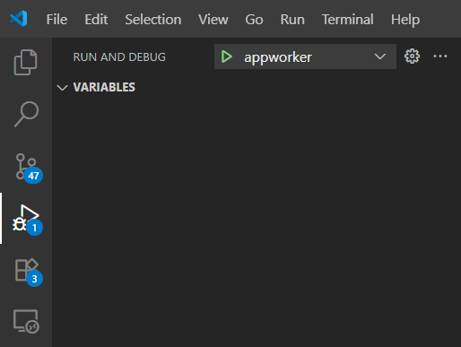
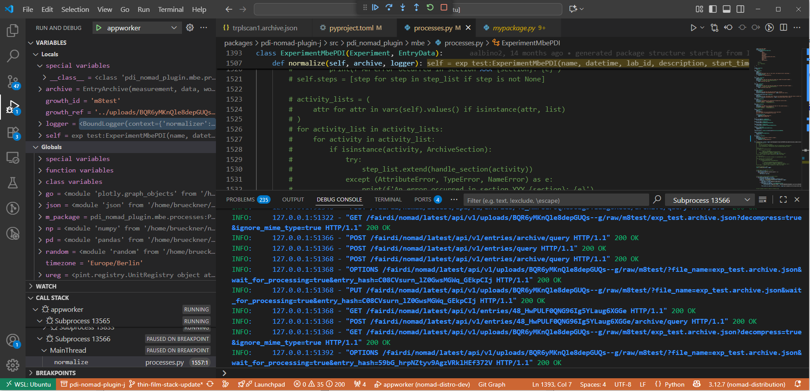

# Part 2: Developing NOMAD plugins

## Modifying an existing plugin

Follow the steps above about adding a plugin to your local NOMAD Development Distribution. You can open the files you want to modify in `packages/<path_to_your_plugin`

Let's open `packages/pdi-nomad-plugin/src/pdi_nomad_plugin/mbe/processes.py` and modify it.

Go to the `ExperimentMbePDI` class and let's add an additional quantity in the root section of this class just before the normalizer function `def normalize`:

```python
my_quantity = Quantity(
        type=str,
        description='Just testing to modify a plugin',
        a_eln=ELNAnnotation(
            component='StringEditQuantity',
        ),
    )
```

Now we have to restart the NOMAD app worker in case it is running already. Therefore press `CTRL + C` in the terminal window where this process is running. Start the NOMAD app again by running `uv run poe start`. In case the GUI is stopped start it by `uv run poe gui start`. To make sure you can see the changes in the GUI type `CTRL + SHIFT + R` to hard reload the current page. Otherwise you might load a cached version which does not show your changes.

## Testing plugins in the terminal

Checking the modified plugin in the GUI can be time consuming. You can also run the `nomad parse` command in a terminak on test files and test if it gets processed.
Let's try out a simple example. Create a new file in `packages/pdi-nomad-plugin/tests/data/mbe/` and name it `test1.archive.json`. Paste the following content
```json
{
    "data": {
        "m_def": "pdi_nomad_plugin.mbe.processes.ExperimentMbePDI",
        "name": "test1",
        "datetime": "2025-09-24T17:05:08.083081+00:00",
        "substrate_holder": {},
        "my_quantity": "this is a test"
    },
    "workflow2": {
        "name": "test1"
    }
}
```
and save it.
You can now run and test you plugin by doing:
```bash
uv run nomad parse packages/pdi-nomad-plugin/tests/data/mbe/test1.archive.json --show-archive
```
This will output the processed NOMAD archive. You can also store the output by using:
```bash
uv run nomad parse packages/pdi-nomad-plugin/tests/data/mbe/test1.archive.json --show-archive > testoutput.archive.json
```

This is more useful when you work on parsing files and want to test some processing where spinning up the appworker and testing inthe GUI for each little change would be too time consuming.

If you have the `nomad-measurment` plugin installed you can run the `nomad-parse` command for example on a XRD file:
```bash
uv run nomad parse packages/nomad-measurements/tests/data/xrd/TwoTheta_scan_powder.rasx
```
This will create a NOMAD archive file named `TwoTheta_scan_powder..archive.json`

We need to run `nomad parse` again on this archive file and store the output in a new archive.json file to access the processed output:

```bash
uv run nomad parse packages/nomad-measurements/tests/data/xrd/TwoTheta_scan_powder.archive.json > test1.archive.json
```

You can also test the plots of the plugin by using `--preview-plots`. This is extremely useful to quickly change plots. Run and see the Plotly plots in corresponding browser tabs:

```bash
uv run nomad parse packages/nomad-measurements/tests/data/xrd/TwoTheta_scan_powder.archive.json --preview-plots
```

Please refer to [plugins documentation](https://nomad-lab.eu/prod/v1/staging/docs/howto/plugins/parsers.html#running-a-parser) to learn more about running parsers from CLI or within Python. Running the parse command within Python can be used to run automatized tests.

## Debugging Plugin Code

Debugging is the process of running your code step by step in order to find problems and understand how it behaves at runtime.
Instead of just looking at log files or error messages, a debugger lets you **pause execution**, **inspect variables**, and **control the flow of your program**. This is one of the most effective ways to fix issues in your plugin code and learn how NOMAD processes your changes.

Running NOMAD locally with a debugger allows you to attach directly to the plugin code while it executes. You can then pause execution at specific lines (breakpoints), check variable values, and follow the program’s logic in detail.

---

### Step 1: Enable the Debugger

Open the file `.vscode/launch.json` in your `nomad-distro-dev` workspace and add the following configuration:

```json
{
  "name": "appworker",
  "type": "python",
  "request": "launch",
  "justMyCode": false,
  "program": "${workspaceFolder}/.venv/bin/nomad",
  "args": ["admin", "run", "appworker"]
}
```

Save the file.

---

### Step 2: Set Breakpoints

1. Open the plugin file you want to inspect in VS Code.
2. Click in the margin (to the left of the line number) where you want execution to pause.
   - A red dot will appear, marking your breakpoint.

---

### Step 3: Run NOMAD in Debug Mode

1. In VS Code, open the **Run and Debug** panel (left sidebar).
2. Select **`appworker`** from the dropdown menu.
3. Press the **Play** button ▶️.



NOMAD will now start in debugging mode.

---

### Step 4: Trigger Your Plugin Code

1. Open the NOMAD GUI in your browser.
2. Perform the action that uses your plugin (e.g., upload a file, run a calculation, etc.).
3. Execution will stop at your breakpoint.



At this point, you can:

- Inspect variable values
- Step through code line by line
- Resume execution with the control buttons

---

### ✅ Summary

- **Breakpoints** stop execution where you want to inspect code
- **Debugger** shows variable values and program flow
- **Run/Debug mode** in VS Code makes it easy to understand what your plugin is doing and fix errors more effectively
