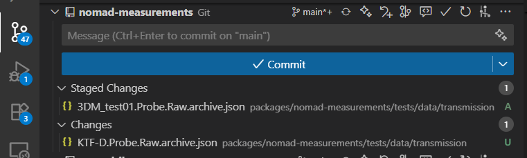

# Part 3: Collaborative Development with Git and GitHub

Git and GitHub are powerful tools for collaboration. They ensure you can track changes, work in parallel, and avoid overwriting each other’s modifications. In this workshop we will practice the basic routines. For a deeper understanding, check out tutorials on YouTube or other learning resources online.

---

## Branching and Pull Requests

It is best practice to create your own branch for any modification you make.
This branch serves as a safe workspace for your changes. Once you are satisfied, you can *commit* the changes and open a *pull request (PR)* to merge them back into the `main` branch.

- **Branches** let you work independently without breaking `main`
- **Commits** record your changes step by step
- **Pull requests (PRs)** allow you to merge your changes after review
- **Branch protection rules** can be set in GitHub (e.g., require review before merging into `main`)

You can perform all these tasks via the terminal or the GUI in VS Code.
It is useful to know both approaches.

---

## GitHub Authentication

Before we can push any code changes to GitHub, we need to make sure each participant is authenticated.
This step is **mandatory** — otherwise `git push` will fail.

---

### Step 1: Check if Authentication Already Works

In your cloned repository, run:
```bash
git remote -v
```

- If the URL starts with `git@github.com:...` → you are set up for **SSH**.
- If it starts with `https://github.com/...` → you are using **HTTPS**.

Try pushing a test change:
```bash
git commit --allow-empty -m "Test commit"
git push origin main
```

- ✅ If it pushes without asking for credentials → authentication works.
- ❌ If you get an error → continue below.

---

### Step 2: Set Up Authentication (choose one)

#### Option A: HTTPS with Personal Access Token (PAT)

1. Go to GitHub → **Settings → Developer settings → Personal access tokens → Tokens (classic)**
2. Generate new token with at least `repo` scope.
3. Configure credential helper:
```bash
git config --global credential.helper store
```
4. Push again:
```bash
git push origin main
```
- Username: your GitHub username
- Password: paste your token

Git will remember it for future pushes.

---

#### Option B: SSH Keys (recommended for long-term use)

1. Generate a new SSH key:
```bash
ssh-keygen -t ed25519 -C "your_email@example.com"
```
2. Start ssh-agent and add your key:
```bash
eval "$(ssh-agent -s)"
ssh-add ~/.ssh/id_ed25519
```
3. Copy the public key:
```bash
cat ~/.ssh/id_ed25519.pub
```
4. Add it to GitHub: **Settings → SSH and GPG keys → New SSH key**
5. Test connection:
```bash
ssh -T git@github.com
```
6. Update your remote (if needed):
```bash
git remote set-url origin git@github.com:USERNAME/REPO.git
```

---

### Step 3: Verify Setup

Try again:
```bash
git push origin main
```

- ✅ Works → you are authenticated
- ❌ Still fails → ask for assistance (common issues: token scopes, firewall/SSH restrictions)

---

## Basic Workflow in the Terminal

### 1. Create a new branch
```bash
git checkout -b my-feature-branch
```

- Creates a new branch named `my-feature-branch` and switches to it.

### 2. Verify you are on the new branch
```bash
git status
```

- Output should show: `On branch my-feature-branch`

### 3. Stage changes
```bash
git add .
```

- Stages all modified files (use `git add <file>` to stage selectively).

### 4. Commit changes
```bash
git commit -m "Add my new feature or fix"
```

- Saves a snapshot of your staged changes to the branch history.

### 5. Push the branch to GitHub
```bash
git push origin my-feature-branch
```

- Uploads your branch to the remote repository on GitHub.

---


## Keeping Your Branch Up to Date

While you work, other contributors may push changes to the `main` branch.
To avoid conflicts, you should regularly sync your branch with `main`.

### 1. Switch to `main` and update it
```bash
git checkout main
git pull origin main
```

### 2. Switch back to your feature branch
```bash
git checkout my-feature-branch
```

### 3. Merge the latest `main` into your branch
```bash
git merge main
```

- If there are conflicts, Git will show them in the files.
- Resolve conflicts, then stage and commit again.

### Alternative: Rebase your branch (cleaner history)
```bash
git checkout my-feature-branch
git pull --rebase origin main
```

---

## After Pushing: Create a Pull Request

1. Go to your repository on GitHub.
2. GitHub will suggest creating a pull request for your new branch.
3. Add a description of the changes and submit the PR.
4. After review, the PR can be merged into `main`.

---
In the *Source Control* panel of VSCode you can do the above mentioned steps:



---

## ✅ Summary

- Always work in a separate branch
- Stage → commit → push your changes
- Open a PR to merge into `main`

This workflow keeps the project history clean and enables smooth collaboration.

## Git Collaboration Cheatsheet

A quick reference for the most common Git commands you will use during the workshop.

---

### Branching & Development

| Command | Purpose |
|---------|---------|
| `git checkout -b my-feature-branch` | Create and switch to a new branch |
| `git status` | Show current branch and changed files |
| `git add .` | Stage all modified files |
| `git add <file>` | Stage a specific file |
| `git commit -m "message"` | Commit staged changes with a message |
| `git push origin my-feature-branch` | Push branch and commits to GitHub |

---

### Syncing with `main`

| Command | Purpose |
|---------|---------|
| `git checkout main` | Switch to main branch |
| `git pull origin main` | Update local main with latest changes from GitHub |
| `git checkout my-feature-branch` | Switch back to your feature branch |
| `git merge main` | Merge updated main into your branch |
| `git pull --rebase origin main` | Alternative: rebase your branch on top of main for cleaner history |

---

### Pull Requests

| Step | Action |
|------|---------|
| 1 | Push your feature branch to GitHub (`git push origin my-feature-branch`) |
| 2 | Open GitHub in browser |
| 3 | Create a Pull Request (PR) into `main` |
| 4 | Add description and request a review |
| 5 | Merge PR once approved |

---

## ✅ Key Rules

- **Never commit directly to `main`** — always use a feature branch.
- **Commit often** with meaningful messages.
- **Sync with `main` regularly** to avoid conflicts.
- **Use PRs** to merge changes into `main` after review.
